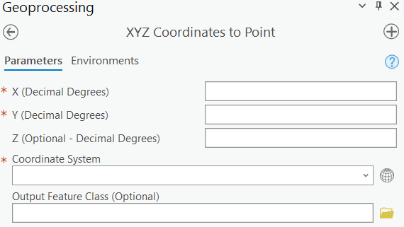

# xyz-coordinates-to-point

* Creates a point feature class/layer from X, Y and Z coordinates (decimal degrees)
* User can specify the output coordinate system
* Output feature class added to active map; and stored as a shapefile on into a file geodatabase

